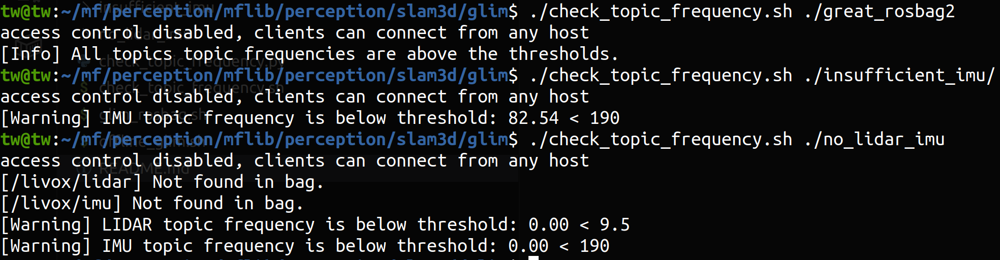

# 🌍 비실시간 맵생성 소스코드
### ⚠️ 주의 사항

- ✅ **LiDAR + IMU, NVIDIA GPU 사용 맵생성**: 지원 (CUDA 드라이버 설치 필수)
- ❌ **LiDAR + IMU, CPU 사용 맵생성**: 지원되지 않음  
- ❌ **LiDAR, CPU 사용 맵생성**: 지원되지 않음  


## 🚀 LiDAR + IMU, GPU 사용 맵생성

### 🔹 1. Check health of rosbag2 (필수아님)
```bash
./check_topic_frequency.sh (abs_path_to_bag)
```
예시:
```bash
./check_topic_frequency.sh ./no_lidar_imu
```


### 🔹 2. Create Dense 3D Map
```bash
./glim_rosbag.sh (abs_path_to_bag)
```

### 🔹 3. Export points to PLY
[🔗 GLIM Quickstart Guide](https://koide3.github.io/glim/quickstart.html)
```bash
./offline_glim.sh
```


---

## ⚙️ 성능 vs 포인트 밀도 관련 중요 파라미터  
🔎 *자세한 기본값은 `./config.orig` 확인*

### 🧭 odometry_estimation
- `"voxel_resolution"`: `0.1`  
- `"voxel_resolution_max"`: `0.1`  
- `"voxelmap_levels"`: `1`  
- `"voxelmap_scaling_factor"`: `1.0`  
- `"keyframe_delta_trans"`: `0.3`  
- `"keyframe_delta_rot"`: `0.1`  
- `"keyframe_max_overlap"`: `0.9`

### 🗺️ sub_mapping
- `"submap_downsample_resolution"`: `0.05`  
- `"submap_target_num_points"`: `60000`  
- `"keyframe_voxel_resolution"`: `0.1`  
- `"keyframe_voxelmap_levels"`: `1`  
- `"keyframe_voxelmap_scaling_factor"`: `1.0`  
- `"keyframe_update_interval_trans"`: `0.5`  
- `"keyframe_update_interval_rot"`: `1.0`  
- `"max_keyframe_overlap"`: `0.8`
